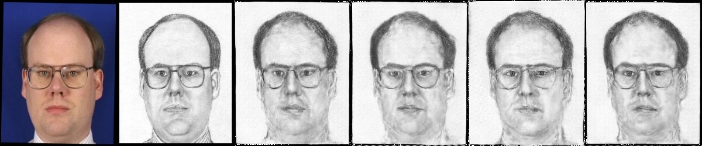
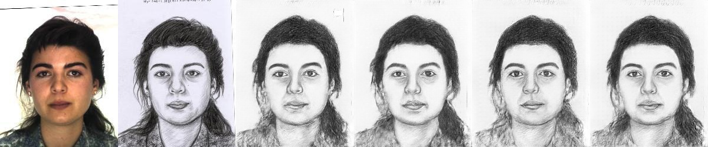

We illustate generated sketches while using one of the following three settings: 

1. Use face labels in G; 
2. use face labels in D; and 
3. use a modified L1 loss (i.e. the proposed compositional loss). 

From left to right: input photo, sketch draw by the artist, cGAN, cGAN+1, cGAN+2, cGAN+3

