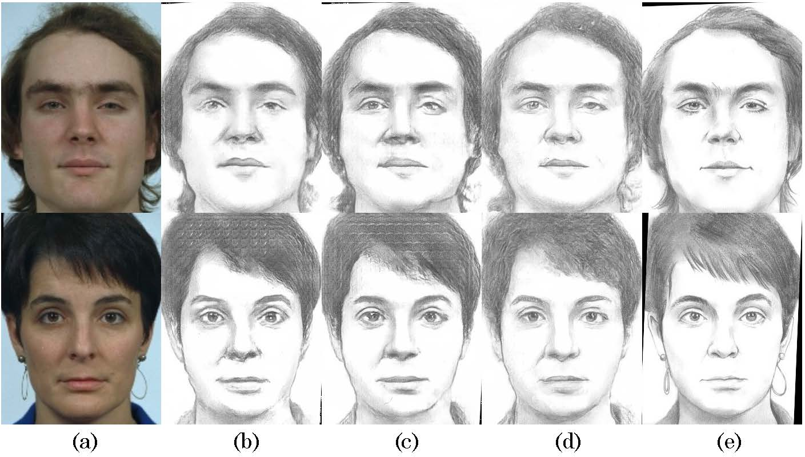
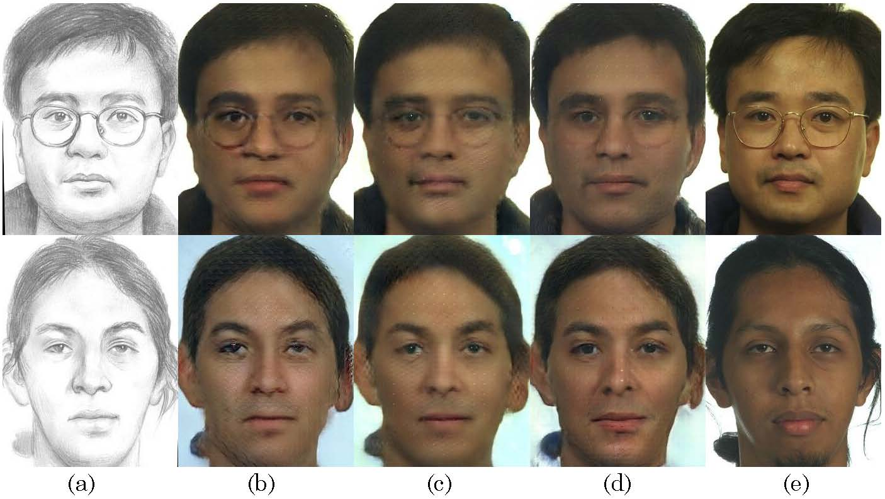

# CA-GAN

------

[[Project Page\]](https://github.com/fei-hdu/ca-gan/) [[Paper\]](https://arxiv.org/abs/1712.00899) 

Results of composition-aided face sketch-photo synthesis.

> **Composition-Aided Face Photo-Sketch Synthesis.**
>
> Fei Gao, Shengjie Shi, Jun Yu,  Dacheng Tao, and Qingming Huang

### Results

**The full results are available at [BaiduCloud](https://pan.baidu.com/s/1PnzNYdwl6Cd2V5gg00ehQQ)**, password: `rhd1`

Due to space limitation, we only list a small number of results here.  The folders are:

- `Photo2Sketch`: Synthesize a sketch image from a photo.
- `Sketch2Photo`: Synthesize a photo image from a sketch.
- `cross dataset`: Models are trained on CUHK dataset and tested on VIPSL dataset.

------

- `(WANG)`: WANG's dividing method. Other images are synthesized with the  model that are trained on dataset of our dividing method. 

------

- Each image has five faces (sketches or photos). 
  - 1: Input image
  - 2: Ground truth
  - 3: Synthesized sketch/photo by cGAN
  - 4: Synthesized sketch/photo by CA-GAN
  - 5: Synthesized sketch/photo by SCA-GAN

### Example results

[](Examples/fig_celeb_sketch.jpg)

[](Examples/fig_sketch_vipsl.jpg)

[](Examples/fig_photo_vipsl.jpg)


### Codes


### Datasets

- [CUHK](http://mmlab.ie.cuhk.edu.hk/archive/facesketch.html)
- [CUFSF](http://mmlab.ie.cuhk.edu.hk/archive/cufsf/index.html)
- [VIPSL-FS](http://www.ihitworld.com/)

### Citation

If you find this useful for your research, please use the following.

```
@article{gao2017ca-gan,
	title = {Composition-Aided Face Photo-Sketch Synthesis},
	author = {Fei Gao, Shengjie Shi, Jun Yu,  Dacheng Tao, and Qingming Huang},
	booktitle = {arXiv:1712.00899},
	year = {2017},
}
```

### Acknowledgements

This code borrows heavily from the [pytorch-CycleGAN-and-pix2pix](https://github.com/junyanz/pytorch-CycleGAN-and-pix2pix) repository.

This work is greatly supported by [Nannan Wang](http://www.ihitworld.com/) and [Chunlei Peng](http://chunleipeng.com/). [ (HIT@Xidian University)](http://www.ihitworld.com/)
