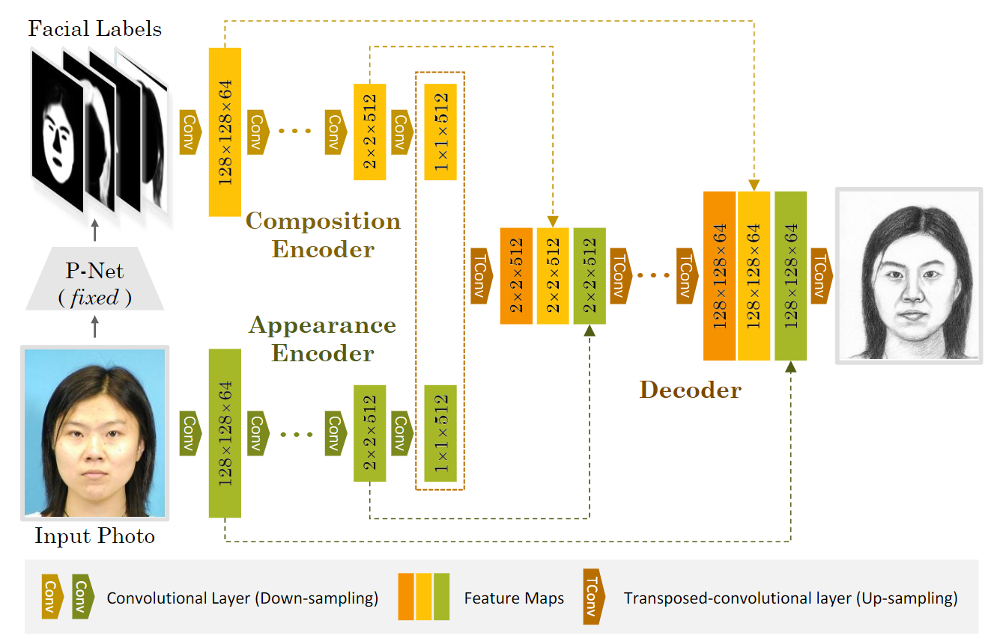
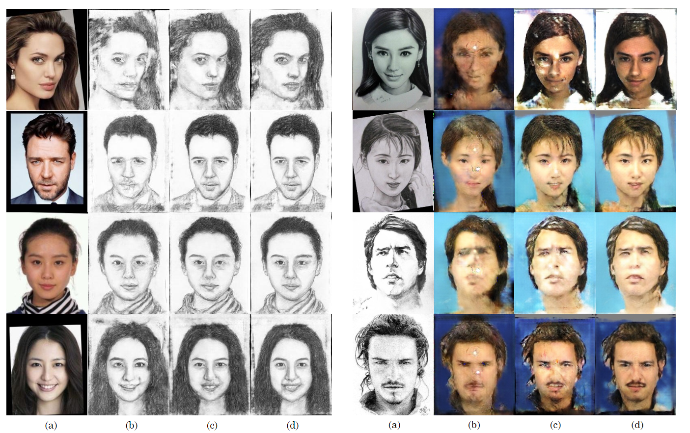

# CA-GAN

We provide **PyTorch** implementation for CA-GAN and SCA-GAN.

Paper "Towards Realistic Face Photo-Sketch Synthesis via Composition-Aided GANs"

| [[Project@Github]](https://github.com/fei-hdu/ca-gan/) | [[Paper@arxiv\]](https://arxiv.org/abs/1712.00899) | [[Project Page]](https://fei-hdu.github.io/ca-gan/) |

### Generator Architecture



## Sample Result

**left:** sketch synthesis; **right:** photo synthesis


> (a)Input Image, (b)cGAN, (c)CA-GAN, (d)SCA-GAN

## Prerequisites

- Linux or similar environment
- Python 2.7
- NVIDIA GPU + CUDA CuDNN

## Getting Started

### Installation
- Clone this repo:
    ```shell script
    git clone https://github.com/fei-hdu/ca-gan
    cd ca-gan
    ```

    ​

- Install PyTorch 0.4+ and torchvision from http://pytorch.org and other dependencies (e.g., visdom and dominate). You can install all the dependencies by

    ```shell script
    pip install -r requirments.txt
    ```

### ca-gan train/test
- Download a dataset([CUFS](http://mmlab.ie.cuhk.edu.hk/archive/facesketch.html) split train and test with this [files]())
- Download the [VGG-Face](http://www.robots.ox.ac.uk/~vgg/software/vgg_face/) model. Here we convert torch weight to pyTorch to fit our frame, you can download our converted model directly: [Google Drive](https://drive.google.com/open?id=1V2dfOLXSgAS9V8PvhTeQAP6KGI40aff_)
- Get face parsing
    - here we use [Face Labling](https://github.com/Liusifei/Face_Parsing_2016) to get face parsing
    - Check out the [new parsing branch](https://github.com/fei-hdu/ca-gan/tree/new_parsing) to get the our newly used 
- Train a model
    ```shell script
    python main.py --model_vgg {model path}
    ```
- Test the model
    ```shell script
    python test.py --dataroot {data path} --fold {epoch number}
    ```
    - The option `fold` is used for load `./checkpoint/netG_epoch_'+fold+'.weight` and you can edit it in `test.py` 

### Apply a pre-trained model
- A face $photo \mapsto sketch$  model  pre-trained on the CUSF: [Google Drive](https://drive.google.com/open?id=17KG1e0-cq_dmidQovzG9vOWZSq3of0Lx)
- The pre-trained model need to be save at `./checkpoint` and named it as `netG_epoch_'+fold+'.weight`
- Then you can test the model

### Datasets
- [CUFS](http://mmlab.ie.cuhk.edu.hk/archive/facesketch.html)
- [CUFSF](http://mmlab.ie.cuhk.edu.hk/archive/cufsf/)

### Result
- Our final result with new parsing can be downloaded: [Google Drive](https://drive.google.com/open?id=1EHpQWzbbF3-BSd93rCclpYtbpbEOZ3p3)


### Training/Test Tips
Best practice for training and testing your models.
Feel free to ask any questions about ***coding***. **Xingxin Xu, [jehovahxu@gmail.com](jehovahxu@gmail.com)**

## Citation
If you find this useful for your research, please cite our paper as:
```
@article{gao2020ca-gan,
	title = {Towards Realistic Face Photo-Sketch Synthesis via Composition-Aided GANs},
	author = {Jun Yu, Xingxin Xu, Fei Gao, Shengjie Shi, Meng Wang, Dacheng Tao, and Qingming Huang},
	booktitle = {IEEE Transactions on Cybernatics},
        doi = {10.1109/TCYB.2020.2972944},
	year = {2020},
	url = {arXiv:1712.00899},
}
```

### Acknowledgments
- Our code is inspired by the [pytorch-CycleGAN-and-pix2pix](https://github.com/junyanz/pytorch-CycleGAN-and-pix2pix) repository.
- This work is greatly supported by [Nannan Wang](http://www.ihitworld.com/) and [Chunlei Peng](http://chunleipeng.com/). [ (HIT@Xidian University)](http://www.ihitworld.com/)


