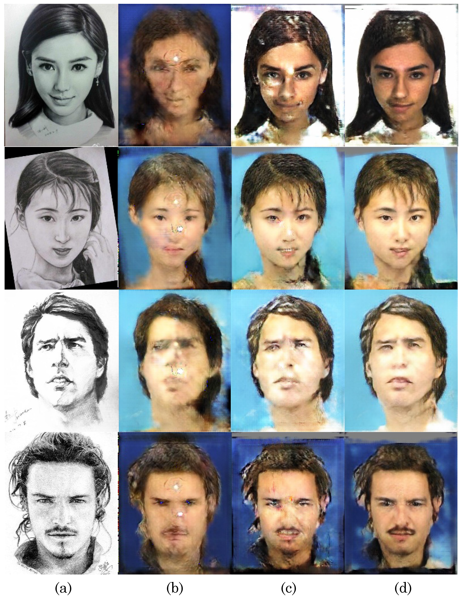
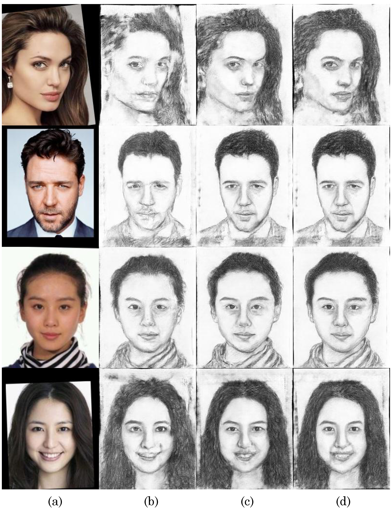

# CA-GAN

------

- [[Project@Github]](https://github.com/fei-hdu/ca-gan/) 
- [[Project Page]](https://fei-hdu.github.io/ca-gan/)
- [[Paper@arxiv\]](https://arxiv.org/abs/1712.00899v3)

Results of composition-aided face sketch-photo synthesis.

> **Towards Realistic Face Photo-Sketch Synthesis via Composition-Aided GANs**
>
> Jun Yu,  Fei Gao*, Shengjie Shi, Xingxin Xu, Meng Wang, Dacheng Tao, and Qingming Huang
>
> \* Corresponding Author: **Fei Gao**, gaofei\@hdu.edu.cn

### Abstract

> Face photo-sketch synthesis aims at generating a facial sketch/photo conditioned on a given photo/sketch. It is of wide applications including digital entertainment and law enforcement. Precisely depicting face photos/sketches remains challenging due to the restrictions on structural realism and textural consistency. While existing methods achieve compelling results, they mostly yield blurred effects and great deformation over various facial components, leading to the unrealistic feeling of synthesized images. 
>
> To tackle this challenge, in this work, we propose to use the facial composition information to help the synthesis of face sketch/photo. Specially, we propose a novel composition-aided generative adversarial network (CA-GAN) for face photo-sketch synthesis. In CA-GAN, we utilize paired inputs including a face photo/sketch and the corresponding pixel-wise face labels for generating a sketch/photo. Next, to focus training on hard-generated components and delicate facial structures, we propose a compositional reconstruction loss. In addition, we employ a perceptual loss function to encourage the synthesized image and real image to be perceptually similar. Finally, we use stacked CA-GANs (SCA-GAN) to further rectify defects and add compelling details. 
>
> Experimental results show that our method is capable of generating both visually comfortable and identity-preserving face sketches/photos over a wide range of challenging data. In addition, our method significantly decrease the best previous Fr\'{e}chet Inception distance (FID) from 36.2 to 26.2 for sketch synthesis, and from 60.9 to 30.5 for photo synthesis. Besides, we demonstrate that the proposed method is of considerable generalization ability. We have made our code and results publicly available: \url{https://fei-hdu.github.io/ca-gan/}.

### Code and Results

- Compressed files: `code_cagan` and `results_cagan`

### Example results



> (a) Input image, (b) cGAN (c)  CA-GAN, (d) SCA-GAN




> (a) Input image, (b) cGAN (c)  CA-GAN, (d) SCA-GAN


### Citation

If you find this useful for your research, please use the following.

```
@article{gao2017ca-gan,
	title = {Towards Realistic Face Photo-Sketch Synthesis via Composition-Aided GANs},
	author = {Jun Yu,  Fei Gao, Shengjie Shi, Xingxin Xu, Meng Wang, Dacheng Tao, and Qingming Huang},
	booktitle = {arXiv:1712.00899},
	year = {2017},
}
```

### Acknowledgements

This code borrows heavily from the [pytorch-CycleGAN-and-pix2pix](https://github.com/junyanz/pytorch-CycleGAN-and-pix2pix) repository.

This work is greatly supported by [Nannan Wang](http://www.ihitworld.com/) and [Chunlei Peng](http://chunleipeng.com/). [ (HIT@Xidian University)](http://www.ihitworld.com/)
